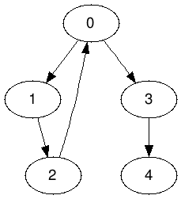
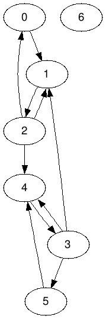

# Отчёт
Лабораторная работа 7 по предмету «Типы и структуры данных».<br/>
__Керимов Ахмед__, ИУ7-34Б, вариант 2.

__Цель работы__ — реализовать алгоритмы обработки графовых структур: поиск
различных путей, проверка связности, построение остовых деревьев минимальной
стоимости.

## Техническое задание
1. Реализовать хранение, ввод, вывод и изменение графов.
2. Определить, является ли граф связным.
3. Граф считать ориентированным.

## Структуры данных

```c++
struct Graph {
	std::size_t n_vertices;
	std::vector<std::list<std::size_t> > adj;

	Graph(std::size_t n_vertices);

	void add_edge(std::size_t v, std::size_t w);
	void remove_edge(std::size_t v, std::size_t w);

	void add_vertex();
	void remove_vertex(std::size_t v);
	void swap_vertices(std::size_t v, std::size_t w);

	bool vertex_exists(std::size_t v) const;
	bool edge_exists(std::size_t v, std::size_t w) const;
	bool can_add_edge(std::size_t v, std::size_t w) const;
};
```

## Аварийные ситуации
1. Ввод неверной команды. Будет выведено сообщение об ошибке.
2. Ввод несуществующего файла. Будет выведено сообщение об ошибке.
3. Ввод несуществующей вершины. Будет выведено сообщение об ошибке.
4. Ввод несуществующего ребра. Будет выведено сообщение об ошибке.
5. Попытка дублирования ребра. Будет выведено сообщение об ошибке.

## Алгоритмы
Базовые алгоритмы работы с орграфом.
```c++
void Graph::add_edge(std::size_t v, std::size_t w) {
	adj[v].push_back(w);
}
```
```c++
void Graph::remove_edge(std::size_t v, std::size_t w) {
	adj[v].remove(w);
}
```
```c++
void Graph::add_vertex() {
	adj.push_back(std::list<std::size_t>());
}
```
```c++
void Graph::remove_vertex(std::size_t v) {
	std::size_t last = n_vertices - 1;
	swap_vertices(v, last);
	for (v = 0; v != last; ++v) {
		adj[v].remove(last);
	}
	adj.pop_back();
	--n_vertices;
}
```
```c++
void Graph::swap_vertices(std::size_t v, std::size_t w) {
	std::swap(adj[v], adj[w]);
	for (std::size_t x = 0; x != n_vertices; ++x) {
		if (x == v || x == w)
			continue;
		for (auto& y : adj[x])
			if (y == v)
				y = w;
			else if (y == w)
				y = v;
	}
}
```

Поиск компонент сильной связности.
```c++
Graph transpose(Graph const& graph) {
	Graph t(graph.n_vertices);
	for (std::size_t v = 0; v != graph.n_vertices; ++v)
		for (auto const w : graph.adj[v])
			t.add_edge(w, v);
	return t;
}
```
```c++
void fill_order(Graph const& graph,
                std::size_t v,
                std::vector<bool>& visited,
                std::stack<std::size_t>& stack) {
	visited[v] = true;
	for (auto const w : graph.adj[v])
		if (!visited[w])
			fill_order(graph, w, visited, stack);
	stack.push(v);
}
```
```c++
void print_dfs(Graph const& graph,
               std::size_t v,
               std::vector<bool>& visited,
               std::ostream& os) {
	visited[v] = true;
	os << v << ' ';
	for (auto const w : graph.adj[v])
		if (!visited[w])
			print_dfs(graph, w, visited, os);
}
```
```c++
// strongly connected components
std::size_t print_scc(Graph const& graph, std::ostream& os) {
	std::stack<std::size_t> stack;
	std::vector<bool> visited(graph.n_vertices, false);
	for (std::size_t v = 0; v != graph.n_vertices; ++v)
		if (!visited[v])
			fill_order(graph, v, visited, stack);

	Graph t = transpose(graph);

	std::size_t scc = 0;
	std::fill(visited.begin(), visited.end(), false);
	while (!stack.empty()) {
		std::size_t v = stack.top();
		stack.pop();

		if (!visited[v]) {
			print_dfs(t, v, visited, os);
			os << std::endl;
			++scc;
		}
	}
	return scc;
}
```

## Тесты
### Аварийные ситуации
Ввод неверной команды.
```
Menu:
1. Create digraph
2. Load digraph
3. Remove digraph
4. List digraphs
0. Exit

>>> dumb
No such action

<press Enter to continue>
```

Ввод несуществующего файла.
```
Menu:
1. Create digraph
2. Load digraph
3. Remove digraph
4. List digraphs
0. Exit

>>> 2

Input filename
>>> sa;dkflj
There is no such file

<press Enter to continue>
```
На следующем графе



Ввод несуществующей вершины.
```
Digraph menu:
1. Display
2. Add vertex
3. Add edge
4. Remove vertex
5. Remove edge
6. Count SCC
7. Save as
0. Exit

>>> 4

Input vertex
>>> 10
Invalid vertex

<press Enter to continue>
```

Ввод несуществующего ребра.
```
Digraph menu:
1. Display
2. Add vertex
3. Add edge
4. Remove vertex
5. Remove edge
6. Count SCC
7. Save as
0. Exit

>>> 5

Input start vertex
>>> 0

Input finish vertex
>>> 2
There is no such edge

<press Enter to continue>
```

Попытка дублирования ребра.
```
Digraph menu:
1. Display
2. Add vertex
3. Add edge
4. Remove vertex
5. Remove edge
6. Count SCC
7. Save as
0. Exit

>>> 3

Input start vertex
>>> 3

Input finish vertex
>>> 4
Edge already exists

<press Enter to continue>
```

### Неаварийные ситуации
Не связный сильно граф.


```
Digraph menu:
1. Display
2. Add vertex
3. Add edge
4. Remove vertex
5. Remove edge
6. Count SCC
7. Save as
0. Exit

>>> 6
Strongly connected components:
0 2 1
3
4
Graph isn't strongly connected

<press Enter to continue>
```

Не связный сильно граф.


```
Digraph menu:
1. Display
2. Add vertex
3. Add edge
4. Remove vertex
5. Remove edge
6. Count SCC
7. Save as
0. Exit

>>> 6
Strongly connected components:
5 6
0
1 2
4 3
Graph isn't strongly connected

<press Enter to continue>
```

Сильно связный граф.


```
Digraph menu:
1. Display
2. Add vertex
3. Add edge
4. Remove vertex
5. Remove edge
6. Count SCC
7. Save as
0. Exit

>>> 6
Strongly connected components:
0 2 1
Graph is strongly connected

<press Enter to continue>
```

Сильно связный граф.


```
Digraph menu:
1. Display
2. Add vertex
3. Add edge
4. Remove vertex
5. Remove edge
6. Count SCC
7. Save as
0. Exit

>>> 6
Strongly connected components:
0 2 1 3 4 5
Graph is strongly connected

<press Enter to continue>
```

Не связный сильно граф.



```
Digraph menu:
1. Display
2. Add vertex
3. Add edge
4. Remove vertex
5. Remove edge
6. Count SCC
7. Save as
0. Exit

>>> 6
Strongly connected components:
6
0 2 1 3 4 5
Graph isn't strongly connected

<press Enter to continue>
```

## Контрольные вопросы
1. _Что такое граф?_

Граф — это конечное множество вершин и соединяющих их рёбер;
$$
G=\{V,E\},
$$
где $V$ — конечное непустое множество вершин, $E$ — множество рёбер (пар
вершин). Если ребра имеют направление, то граф называется ориентированным; если
рёбра имеют вес, то граф называется взвешенным.

2. _Как представляются графы в памяти?_

Существуют различные методы представления графов в программе. Матрица смежности
$B_{n\times n}$ – элемент $b_{ij}=1$, если существует ребро, связывающее вершины
$i$ и $j$, и равно $0$, если ребра не существует. Список смежностей – содержит
для каждой вершины из множества вершин $V$ список тех вершин, которые
непосредственно связаны с ней. Входы в списки смежностей могут храниться в
отдельной таблице, либо же каждая вершина может хранить свой список смежностей.

3. _Какие операции возможны над графами?_

Добавление/удаление вершин или дуг, объединение графов, обход вершин, поиск
различных путей: кратчайшего пути от вершины к вершине; кратчайшего пути от
вершины ко всем остальным; кратчайших путей от каждой вершины к каждой; поиск
эйлерова пути и гамильтонова пути, если таковые есть в графе.

4. _Какие способы обхода графов существуют?_

Один из основных методов проектирования графовых алгоритмов – поиск в глубину.
Начиная с некоторой вершины $v_0$, ищется смежная ей вершина $v$, для которой в
свою очередь осуществляется поиск в глубину до тех пор, пока не встретится ранее
просмотренная вершина, или не закончится список смежности вершины $v$ (то есть
вершина полностью обработана). Если нет новых вершин, смежных с $v$, то вершина
$v$ считается использованной, идёт возврат в вершину, из которой попали в
вершину $v$, и процесс продолжается до тех пор, пока не получим $v=v_0$. При
просмотре используется стек.

Поиск в ширину – обработка вершины $v$ осуществляется путём просмотра сразу всех
«новых» соседей этой вершины, которые последовательно заносятся в очередь
просмотра.

Для поиска компонент сильной связности графа используются алгоритмы Косарайю,
Габова и Тарьяна.

5. _Где используются графовые структуры?_

Графовые структуры могут использоваться в задачах, в которых между элементами
могут быть установлены произвольные связи, необязательно иерархические. Наиболее
распространённым является использование графов при решении различных задач о
путях, будь то построение коммуникационных линий между городами или прокладка
маршрута на игровом поле.

6. _Какие пути в графе Вы знаете?_

Путь в графе, проходящий через каждое ребро ровно один раз, называется эйлеровым
путём; путь может проходить по некоторым вершинам несколько раз – в этом случае
он является непростым.

Путь, проходящий через каждую вершину ровно один раз, называется гамильтоновым
путём. Как эйлеров, так и гамильтонов путь могут не существовать в некоторых
графах.

7. _Что такое каркасы графа?_

Каркас графа – дерево, в которое входят все вершины графа, и некоторые (не
обязательно все) его рёбра.

Для построения каркасов графа используются алгоритмы Крускала и Прима.
