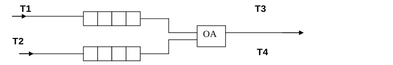

# Отчёт
Лабораторная работа 5 по предмету «Типы и структуры данных».<br/>
__Берёзкин Алексей__, ИУ7-31Б, Вариант 6.

__Цель работы.__ Приобрести навыки работы с типом данных «очередь»,
представленным в виде одномерного массива и односвязного линейного списка,
провести сравнительный анализ реализации алгоритмов включения и исключения
элементов из очереди при использовании указанных структур данных, оценить
эффективности программы по времени и по используемому объёму памяти.

## Техническое задание
__Задача.__ Система массового обслуживания состоит из обслуживающего аппарата
(OA) и двух очередей заявок двух типов.



Заявки 1-го и 2-го типов поступают в «хвосты» своих очередей по случайному
закону с интервалами времени T1 и T2. В OA они поступают из «головы» очереди по
одной и обслуживаются также равновероятно за времена T3 и T4, после чего
покидают систему. (Все времена — вещественного типа) В начале процесса в системе
заявок нет.

Заявка 2-го типа может войти в ОА, если в системе нет заявок 1-го типа. Если в
момент обслуживания заявки 2-го типа в пустую очередь входит заявка 1-го типа,
то она немедленно поступает на обслуживание; обработка заявки 2-го типа
прерывается и она возвращается в "хвост" своей очереди.

Смоделировать процесс обслуживания первых 1000 заявок 1-го типа, выдавая после
обслуживания каждых 100 заявок 1-го типа информацию о текущей и средней длине
каждой очереди, а в конце процесса - общее время моделирования и количестве
вошедших в систему и вышедших из нее заявок обоих типов, среднем времени
пребывания заявок в очереди, количестве «выброшенных» заявок второго типа.

__Входные данные.__ Интервалы времён Т1, Т2, Т3, Т4; N - число заявок первого
типа для обработки; P - каждые P обработанных заявок первого типа делать дамп
информации.

__Выходные данные.__ Лог-файл событий с указаниями, в какой момент времени они
произошли (0.1 – добавление элемента в очередь; 0.23 – завершение обработки
элемента, начало обработки нового; и т.д.).
Функция программы: реализация системы обработки заявок из двух очередей, с
абсолютным приоритетом и повторным обслуживанием.

## Аварийные ситуации
1. Некорректный ввод какого-либо значения (интервал времени, количество заявок),
либо соответствующая строка пуста. Будет выведено сообщение об ошибке.
2. При реализации очереди массивом, может возникнуть переполнение массива при
попытке добавить в него очередной элемент. По событиям `q1_next` и `q2_next`
происходит проверка на переполнение очереди. Если очередь полна, то добавления
элемента не происходит, в лог выводится сообщение об ошибке.

## Структуры
```c++
template <typename T>
struct IQueue {
public:
	IQueue();
	virtual ~IQueue() { }

	virtual void push(const T data) = 0;
	virtual T pop() = 0;
	virtual T top() const = 0;

	size_t size() const;
	bool is_empty() const;
	virtual bool is_full() const = 0;

	virtual void clear() = 0;
protected:
	size_t size_;
};
```

```c++
// кольцевая очередь
template <typename T>
struct QueueArray : public IQueue<T> {
public:
	QueueArray(const size_t limit = LIMIT);
	~QueueArray() override;

	void push(const T data) override;
	T pop() override;
	T top() const override;

	bool is_full() const override;

	void clear() override;
protected:
	T *array_;

	size_t pin_;
	size_t pout_;
	size_t limit_;

	static const size_t LIMIT = 8192;
};
```
<!-- ** crutch for atom -->

```c++
template <typename T>
struct QueueLinkedList : public IQueue<T> {
public:
	QueueLinkedList();
	~QueueLinkedList() override;

	void push(const T data) override;
	T pop() override;
	T top() const override;

	bool is_full() const override;

	void clear() override;

	size_t vtop() const;
protected:
	Node<T>* prehead_;
	Node<T>* tail_;
};
```

```c++
struct Request {
public:
	double time;
	int8_t type;
public:
	Request(const int8_t type = 0);
};
```

```c++
struct OA {
	Request target;
	bool is_target;
	int8_t processing;
	double triggertime;
	double timespent;
};
```

```c++
struct Interval {
	double from;
	double to;
};

struct Options {
	Interval q1, q2;
	Interval a1, a2;

	size_t num;
	size_t period;

	int8_t type;
};
```

## Алгоритм
### Push
``` c++
template <typename T>
void QueueArray<T>::push(const T data) {
	assert(!is_full());

	array_[pout_] = data;
	pout_ = (pout_ + 1) % limit_;
	++IQueue<T>::size_;
}

template <typename T>
void QueueLinkedList<T>::push(const T data) {
	tail_ = tail_->next = new Node<T>(data);
	++IQueue<T>::size_;
}
```
### Pop
``` c++
template <typename T>
T QueueArray<T>::pop() {
	assert(!IQueue<T>::is_empty());

	T ret = array_[pin_];
	pin_ = (pin_ + 1) % limit_;
	--IQueue<T>::size_;
	return ret;
}

template <typename T>
T QueueLinkedList<T>::pop() {
	assert(!IQueue<T>::is_empty());

	Node<T>* tmp = prehead_;
	prehead_ = prehead_->next;
	delete tmp;
	--IQueue<T>::size_;
	return prehead_->data;
}
```
### Top
```c++
template <typename T>
T QueueArray<T>::top() const {
	assert(!IQueue<T>::is_empty());

	return array_[pin_];
}

template <typename T>
T QueueLinkedList<T>::top() const {
	assert(!IQueue<T>::is_empty());

	return prehead_->next->data;
}
```

### Основной
```c++
void start(const Options& options);
```

Функция получает набор параметров. Процедура обработки реализована с
использованием переменной «глобального» времени `timepass`, и «будильников», по
которым происходит какое-либо событие: `q1_next`, `q2_next` для добавления
элемента в соответствующую очередь; `oa.triggertime` для завершения автоматом
обработки элемента. Все действия происходят в цикле до тех пор, пока не будет
обработано указанное количество заявок первого типа (`processed1`).

На очередной итерации, происходит последовательная проверка прошедшего времени
на какое-либо событие, а также анализ состояния автомата. Если `timepass` равно
`q1_next`, то происходит добавление элемента в очередь `q1`, вычисляется новое
`q1_next`.

Если `timepass` равно `q2_next`, то аналогично поступаем с очередью `q2`.

Если `timepass` равно `oa.triggertime`, то происходит извлечение элемента из
автомата (и его удаление); суммарное время работы автомата увеличивается на
время, затраченное автоматом на данный элемент.

Если автомат обрабатывает элемент второго типа, и при этом не пуста очередь
`q1`, то происходит смена приоритетов – обрабатываемый элемент извлекается и
переносится в «хвост» очереди `q2`, автомат «заряжается» «лентой» `q1`;
суммарное время «потраченное впустую» автоматом увеличивается на время,
затраченное автоматом на данный элемент.

Если автомат не обрабатывает никакой элемент, то происходит попытка «зарядить»
его «лентой» `q1`; если она пуста – то «лентой» `q2`; если же пуста и она – то
автомат простаивает. Выбирается ближайшее событие – добавление элемента в `q1`
или `q2`; в переменную `buf` записывается, сколько времени до него осталось; это
время добавляется к суммарному времени простоя автомата.

Если же автомат обрабатывает какой-либо элемент, то выбирается ближайшее событие
– добавление элемента, либо завершение автоматом обработки; в переменную `buf`
записывается, сколько времени до него осталось.

Если количество обработанных элементов делится на «период» `Р`, то делается дамп
информации.

К прошедшему времени `timepass` добавляется ранее высчитанное значение `buf` –
время «проматывается» к ближайшему возможному событию. Если при этом автомат
работает, то к его времени обработки текущего элемента также добавляется
значение `buf`. Наконец, обновляются обе очереди `q1` и `q2`, время всех
элементов в них увеличивается на `buf`.

При реализации очереди через массив процесс аналогичен, однако функции для
работы с очередью получают также размер массива (максимальное количество
элементов).

## Тесты

__Очередь Q1 не накапливается__
Т1: 1 .. 5.000; mid = 3
Т3: 0 .. 2.000; mid = 1
Среднее время обработки заявок меньше среднего периода их добавления;
моделирование производится по входу.
Ожидаемое время моделирования: 1000 * 3 = 3000 е.в.

Тесты при реализации очереди списком:
<table>
	<tr>
		<th>#</th>
		<th>Число вошедших заявок 1 типа</th>
		<th>Время работы (мкс)</th>
		<th>Время моделирования (е. в.)</th>
		<th>Используемая память (байт)</th>
	</tr>
	<tr>
		<th>1</th>
		<td>1000</td>
		<td>0,319946</td>
		<td>3017,806</td>
		<td>96</td>
	</tr>
	<tr>
		<th>2</th>
		<td>1000</td>
		<td>0,290156</td>
		<td>3017,936</td>
		<td>96</td>
	</tr>
	<tr>
		<th>3</th>
		<td>1000</td>
		<td>0,284832</td>
		<td>2929,915</td>
		<td>120</td>
	</tr>
	<tr>
		<th>4</th>
		<td>1002</td>
		<td>0,290950</td>
		<td>2975,613</td>
		<td>96</td>
	</tr>
	<tr>
		<th>5</th>
		<td>1000</td>
		<td>0,286228</td>
		<td>2970,460</td>
		<td>96</td>
	</tr>
	<tr>
		<th>Сред.</th>
		<td>1000</td>
		<td>0,294422</td>
		<td>2982,346</td>
		<td>101</td>
	</tr>
</table>

Расхождение: (3000 - 2928,346) / 3000 = 0,59 %

Тесты при реализации очереди массивом:
<table>
	<tr>
		<th>#</th>
		<th>Число вошедших заявок 1 типа</th>
		<th>Время работы (мкс)</th>
		<th>Время моделирования (е. в.)</th>
		<th>Используемая память (байт)</th>
	</tr>
	<tr>
		<th>1</th>
		<td>1000</td>
		<td>0,391806</td>
		<td>2931,790</td>
		<td>131072</td>
	</tr>
	<tr>
		<th>2</th>
		<td>1001</td>
		<td>0,394597</td>
		<td>2953,408</td>
		<td>131072</td>
	</tr>
	<tr>
		<th>3</th>
		<td>1000</td>
		<td>0,353375</td>
		<td>2989,006</td>
		<td>131072</td>
	</tr>
	<tr>
		<th>4</th>
		<td>1000</td>
		<td>0,362217</td>
		<td>2965,452</td>
		<td>131072</td>
	</tr>
	<tr>
		<th>5</th>
		<td>1000</td>
		<td>0,367905</td>
		<td>3022,625</td>
		<td>131072</td>
	</tr>
	<tr>
		<th>Сред.</th>
		<td>1000</td>
		<td>0,37398</td>
		<td>2972,456</td>
		<td>131072</td>
	</tr>
</table>

Расхождение: (3000 - 2972,456) / 3000 = 0,9 %

__Очередь Q1 накапливается__
Т1: 1 .. 5.000; mid = 3
Т3: 4 .. 8.000; mid = 6
Среднее время обработки заявок больше среднего периода их добавления;
моделирование производится по выходу.
Ожидаемое время моделирования: 1000 * 6 = 6000 е.в.

Тесты при реализации очереди списком:
<table>
	<tr>
		<th>#</th>
		<th>Число вошедших заявок 1 типа</th>
		<th>Время работы (мкс)</th>
		<th>Время моделирования (е. в.)</th>
		<th>Используемая память (байт)</th>
	</tr>
	<tr>
		<th>1</th>
		<td>1975</td>
		<td>0,915263</td>
		<td>5935,198</td>
		<td>23424</td>
	</tr>
	<tr>
		<th>2</th>
		<td>2017</td>
		<td>1,143671</td>
		<td>5993,871</td>
		<td>24432</td>
	</tr>
	<tr>
		<th>3</th>
		<td>2011</td>
		<td>1,087431</td>
		<td>5952,331</td>
		<td>24288</td>
	</tr>
	<tr>
		<th>4</th>
		<td>2004</td>
		<td>1,119914</td>
		<td>5950,194</td>
		<td>24120</td>
	</tr>
	<tr>
		<th>5</th>
		<td>2034</td>
		<td>1,125915</td>
		<td>6029,622</td>
		<td>24840</td>
	</tr>
	<tr>
		<th>Сред.</th>
		<td>2008</td>
		<td>1,078439</td>
		<td>5972,243</td>
		<td>24421</td>
	</tr>
</table>

Расхождение: (6000 - 5972,443) / 6000 = 0,46 %

Тесты при реализации очереди массивом:
<table>
	<tr>
		<th>#</th>
		<th>Число вошедших заявок 1 типа</th>
		<th>Время работы (мкс)</th>
		<th>Время моделирования (е. в.)</th>
		<th>Используемая память (байт)</th>
	</tr>
	<tr>
		<th>1</th>
		<td>1199</td>
		<td>0,343027</td>
		<td>6028,234</td>
		<td>131072</td>
	</tr>
	<tr>
		<th>2</th>
		<td>1199</td>
		<td>0,345780</td>
		<td>5988,792</td>
		<td>131072</td>
	</tr>
	<tr>
		<th>3</th>
		<td>1199</td>
		<td>0,365323</td>
		<td>6050,381</td>
		<td>131072</td>
	</tr>
	<tr>
		<th>4</th>
		<td>1199</td>
		<td>0,335411</td>
		<td>6001,193</td>
		<td>131072</td>
	</tr>
	<tr>
		<th>5</th>
		<td>1199</td>
		<td>0,354761</td>
		<td>5962,208</td>
		<td>131072</td>
	</tr>
	<tr>
		<th>Сред.</th>
		<td>1199</td>
		<td>0,348860</td>
		<td>6006,162</td>
		<td>131072</td>
	</tr>
</table>

Расхождение: (6006,162 - 6000) / 6000 = 0,11 %

Подводя итог: при реализации очереди массивом мы получаем выигрыш как в
используемой памяти, так и во времени работы. Тем не менее, при таком подходе
лог забивается сообщениями о переполнении очереди:
```
[X] Error: (_1203.061_) Couldn't add element to Q1, it's full!
```

Таким образом, реализацию очереди массивом целесообразно делать только в том
случае, когда размер очереди невелик, или же не попадающими в очередь
элементами (при переполнении) можно пренебречь.

## Вопросы
1. Что такое очередь?

Очередь – это последовательный список переменной длины, включение элементов в
который идёт с одной стороны (с «хвоста»), а исключение – с другой стороны (с
«головы»). Принцип работы очереди: первым пришел – первым вышел, т. е. First In
– First Out (FIFO).

2. Каким образом, и какой объем памяти выделяется под хранение очереди при
различной её реализации?

При реализации очереди списком, под каждый новый элемент выделяется память из
кучи, элементы связываются указателями.

При реализации очереди массивом, выделяется блок памяти из `N * sizeof elem`
байт, где $N$ – максимальное количество элементов в очереди, элементы следуют
друг за другом последовательно

3. Каким образом освобождается память при удалении элемента из очереди при
её различной реализации?

При реализации очереди списком, головной элемент считывается, указатель на
«голову» очереди переходит на следующий элемент, считанный элемент удаляется.

При реализации очереди массивом, головной элемент считывается, остальные
элементы массива сдвигаются на 1 – длина очереди уменьшается на 1, элемент [1]
массива «затирает» головной элемент [0].

4. Что происходит с элементами очереди при ее просмотре?

При просмотре очереди, головной элемент из неё удаляется. Остальные элементы
сдвигаются (массив), либо указатель на начало передвигается на следующий
элемент (список).

5. Каким образом эффективнее реализовывать очередь. От чего это зависит?

При реализации очереди списком, проще всего добавлять и удалять из неё
элементы, однако может возникнуть фрагментация памяти. При реализации очереди
массивом дефрагментации не возникает, однако может возникнуть переполнение
памяти, а добавление и удаление элементов сложнее. Способ реализации зависит от
того, в чем мы сильнее ограничены – в памяти или во времени выполнения
операций.

6. В каком случае лучше реализовать очередь посредством указателей, а в
каком – массивом?

Очередь лучше реализовывать с помощью указателей, если новые элементы в
среднем появляются реже, чем происходит полное очищение очереди — в общем
случае фрагментация не возникает. Реализация с помощью указателей применима
если требуется строгий контроль фрагментации.

7. Каковы достоинства и недостатки различных реализаций очереди в
зависимости от выполняемых над ней операций?

При реализации очереди массивом не возникает фрагментации памяти, однако
может произойти переполнение очереди, а также затрачивается дополнительное
время на сдвиг элементов. Сдвига можно избежать, если использовать кольцевой
массив, однако при этом усложняются операции добавления и удаления элементов.
Наконец, при реализации списком проще всего реализуются алгоритмы добавления и
удаления элементов, но может возникнуть фрагментация.

8. Что такое фрагментация памяти?

Фрагментация – чередование участков памяти при последовательных запросах на
выделение и освобождение памяти. «Занятые» участки чередуются со «свободными» —
однако последние могут быть недостаточно большими для того, чтобы сохранить в
них нужное данное.

В моей программе фрагментации памяти не происходит, при стандартных условиях
программы после обработки тысячи заявок первого типа количество элементов,
которые были освобождены, но не были заново аллоцированы, порядка 20 элементов.

9. На что необходимо обратить внимание при тестировании программы?

При реализации очереди списком необходимо следить за освобождением памяти
при удалении элемента из очереди. Если новые элементы приходят чаще, чем
удаляются старые, очередь растёт и может происходить фрагментации памяти.

10. Каким образом физически выделяется и освобождается память при
динамических запросах?

Программа даёт запрос ОС на выделение блока памяти необходимого размера. ОС
находит подходящий блок, записывает его адрес и размер в таблицу адресов, а
затем возвращает данный адрес в программу.

При запросе на освобождение указанного блока программы, ОС убирает его из
таблицы адресов, однако указатель на этот блок может остаться в программе.
Попытка считать данные из этого блока может привести к непредвиденным
последствиям, поскольку они могут быть уже изменены.
